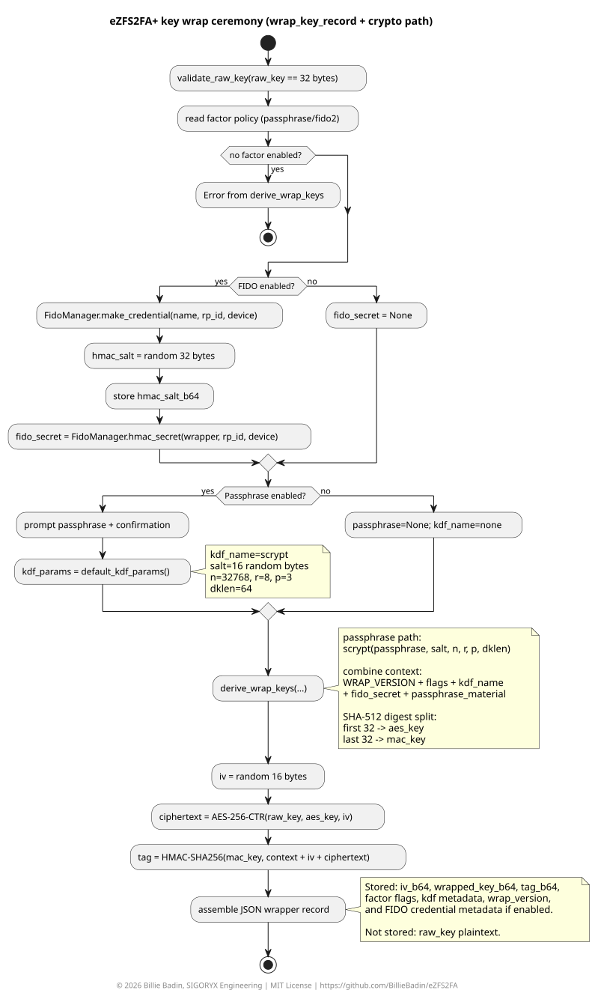
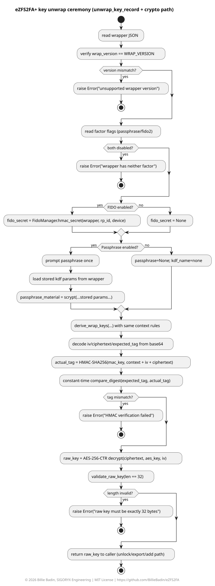
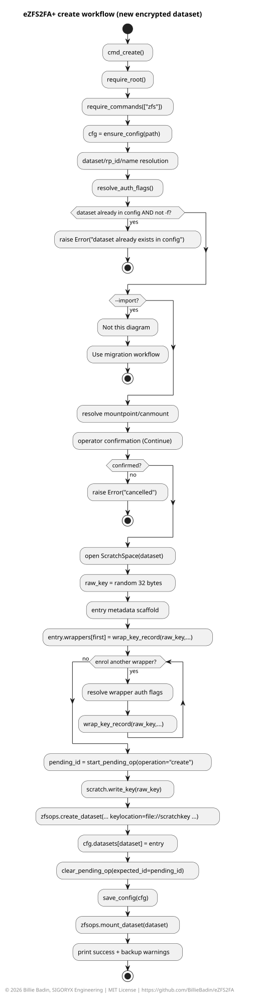
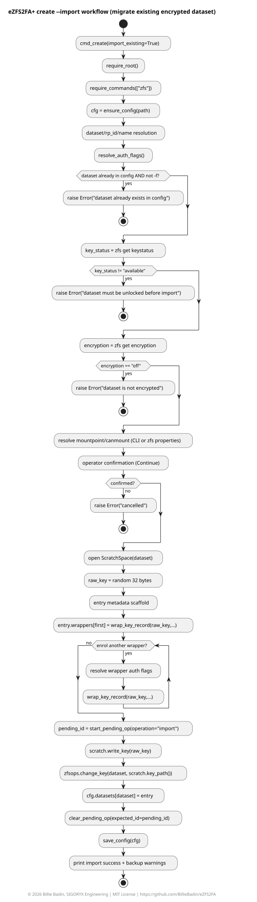
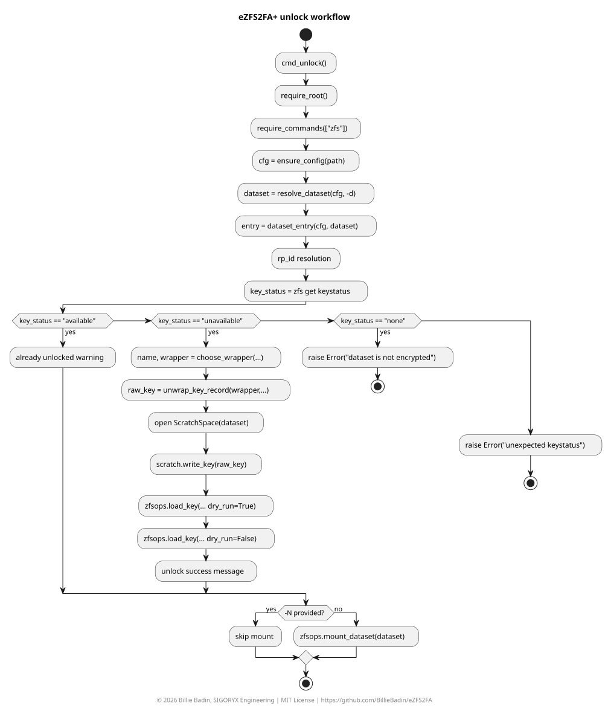

# eZFS2FA+

`ezfs2fa` protects **OpenZFS** encrypted datasets using one or both of:

- a local wrapping passphrase;
- a FIDO2/YubiKey using the `hmac-secret` extension.

FreeBSD is the first-class target. Linux compatibility is included through a platform-specific volatile scratch layer, and Windows compatibility is supported through `keyformat=hex` prompt workflows and a compatibility scratch-directory fallback.

```text
FreeBSD    volatile scratch via mdmfs -M, malloc-backed md(4) + UFS
Linux      volatile scratch via ramfs
Windows    prefer --hex prompt path (no raw key scratch mount required)
```

ZFS and scratch setup use native OS commands.
FIDO2 backend selection is OS-specific:

- Preferred on all OS: Python backend through `python-fido2`.
- Windows: Python backend uses native WebAuthn (`WindowsClient`).
- FreeBSD/Linux: if Python backend is unavailable, fallback to CLI backend (`fido2-token`, `fido2-cred`, `fido2-assert`).

## Persistent state

All persistent recovery metadata lives in one JSON file.

Installed defaults:

```text
FreeBSD    /usr/local/etc/ezfs2fa.json
Linux      /etc/ezfs2fa.json
Windows    %ProgramData%\ezfs2fa\ezfs2fa.json
```

Standalone mode is also supported. If `ezfs2fa.py` is run outside the installed libexec directory, it uses `ezfs2fa.json` next to the script by default.

The JSON file contains dataset metadata, FIDO2 credential IDs + salts, per-wrapper KDF metadata, IVs, wrapped-key ciphertexts, HMAC tags, convenience device metadata, per-wrapper backup timestamps (`last_export_at`), backup evidence timestamps for `pack` and `export-raw`, and pending operation journal state (`pending_op`). It does **not** contain the raw OpenZFS dataset key.

Back up this JSON file. Without it, the FIDO2 key alone is not enough to reconstruct the same `hmac-secret` context.

Every command run checks backup evidence and warns when no evidence exists yet. Warnings continue until either:

- all wrappers have `last_export_at`;
- `pack` has been run at least once;
- `export-raw` has been run at least once.

You can manually stamp wrapper backup timestamps with `--manualbackup`, but this only records operator intent. You are still responsible for keeping real protected backups.

In-memory secret handling uses mutable buffers (`bytearray`) with explicit best-effort zeroing after use. Python/runtime internals may still retain transient immutable copies, so this is defense-in-depth, not a formal memory-sanitization guarantee.

## Security model

The OpenZFS key is always 32 bytes.
It is generated randomly by `ezfs2fa` for `create` / `create --migrate`; `--hex` changes keyformat and transport, not entropy source.
Each wrapper encrypts that raw key using one of these modes:

- passphrase only
- FIDO2 hmac-secret only
- passphrase + FIDO2 hmac-secret

Every wrapper records two explicit flags:

```json
"passphrase": true,
"fido2":      true
```

or another combination, depending on how it was created.

Wrappers are strict `ezfs2fa-wrap-v3.0.1` records at runtime.
Legacy `ezfs2fa-wrap-v3.0.0` wrappers must be explicitly upgraded with `upgrade-wrappers` before unlock/export/add operations.
Config loading is also strict: missing required keys are treated as invalid config and are not auto-upgraded.

---

## Key wrap/unwrap internals (audit)

This section describes exactly how `ezfs2fa` protects the 32-bytes OpenZFS raw key.

Click on the ***Show: ... diagram*** section title to display the PlantUML workflow diagram.

### Enrol / wrap path

1. Generate random 32-bytes raw key.
2. Collect enabled factors:
   - passphrase (optional);
   - FIDO2 `hmac-secret` output (optional).
3. If passphrase is enabled, generate per-wrapper `scrypt` metadata:
   - `kdf_name=scrypt`
   - random `kdf_salt_b64` (16 bytes)
   - `kdf_n=32768`, `kdf_r=8`, `kdf_p=3`, `kdf_dklen=64`
4. Derive passphrase material using `hashlib.scrypt(...)` with the stored parameters.
5. Derive final wrapping material with HKDF-SHA-512:
   - HKDF-Extract over combined factor material;
   - HKDF-Expand with wrapper context (`passphrase`, `fido2`, `kdf_name`).
6. Split HKDF output into:
   - first 32 bytes: AES-256 key;
   - last 32 bytes: HMAC-SHA256 key.
7. Encrypt raw key using in-process AES-256-CTR with random 16-byte IV.
8. Authenticate wrapper payload with HMAC-SHA256 over:
   - wrapper version context;
   - factor flags;
   - KDF name;
   - IV + ciphertext.

<details>
<summary><strong>Show: key wrap ceremony diagram</strong></summary>
<br>

</details>

### Unlock / unwrap path

1. Validate wrapper version is exactly `ezfs2fa-wrap-v3.0.1`.
2. Re-collect enabled factors (passphrase and/or FIDO2 `hmac-secret`).
3. Recompute scrypt-derived passphrase material from stored per-wrapper KDF metadata.
4. Re-derive AES/HMAC keys using the same context/factors/KDF name and wrapper `wrap_kdf` metadata.
5. Verify HMAC before decrypting.
6. Decrypt wrapped key using AES-256-CTR.
7. Validate decrypted raw key length is exactly 32 bytes.

This gives explicit integrity-before-decrypt behavior and binds both factor policy and KDF metadata into authenticated context.

Compatibility note:
- runtime unwrap paths are current-version only (`ezfs2fa-wrap-v3.0.1`);
- legacy `ezfs2fa-wrap-v3.0.0` wrappers are upgraded via `ezfs2fa upgrade-wrappers`.

When FIDO2 is enabled, the tool stores best-effort metadata about the hardware key, including serial number when `ykman list --serials` is available and sees exactly one key. This metadata is informational only. The real binding is the FIDO2 credential and the `hmac-secret` result.

<details>
<summary><strong>Show: key unwrap ceremony diagram</strong></summary>
<br>

</details>

---

## FIDO2 backend

FIDO2 backend is multi-stack with automatic selection.

### Python backend (preferred)

Required Python package:

- `fido2`

Install with:

```powershell
python -m pip install fido2
```

Or, on systems with multiple Python versions:

```powershell
py -3 -m pip install fido2
```

On Windows, FIDO2 actions use the native WebAuthn UI. In practice, both `create` and `unlock` usually follow this order:
1. select passkey location;
2. touch the key;
3. enter PIN/biometric;
4. touch the key again.
Explicit CLI device-path override (`-D`) is ignored on Windows WebAuthn.

On FreeBSD/Linux, python-fido2 uses direct HID access. Device-path override (`-D`) is supported and matches HID path values.

### libfido2 CLI backend (non-Windows fallback)

Required commands:

- `fido2-token`
- `fido2-cred`
- `fido2-assert`

On the tested Pi-BSD/YubiKey setup, `/dev/uhid0` worked reliably while `/dev/hidraw1` could hang.
You can force the device path with:

```sh
ezfs2fa fido-list -D /dev/uhid0
```

During FIDO operations:

1. enter the PIN if prompted;
2. touch the key when it flashes (The prompt to touch isn't explicit, and easily forgotten. You'll get used to it!).

The CLI backend uses explicit `-i` and `-o` files for `fido2-cred` and `fido2-assert`, because that was the reliable `libfido2` path on FreeBSD.
Those temporary FIDO files are created on the same volatile scratch storage used for ZFS key material and are wiped immediately.

### Windows (WebAuthn backend)

Required Python package:

- `fido2`

Install with:

```powershell
python -m pip install fido2
```

Or, on systems with multiple Python versions:

```powershell
py -3 -m pip install fido2
```

Windows passkey workflow note (`create` and `unlock`):
1. select passkey location;
2. touch the key;
3. enter PIN/biometric;
4. touch the key again.

## Volatile scratch space

The scratch layer is transparent to the user.

### FreeBSD
On FreeBSD, `ezfs2fa` uses:

```sh
mdmfs -M -s 1048576b -p 0700 -w root:wheel -o noatime md /var/run/ezfs2fa/<label>
```

This creates a malloc-backed md(4) disk, creates UFS on it, and mounts it. The scratch allocation is fixed at 1 MiB (1024 * 1024 bytes). The raw ZFS key is written as a regular 32-bytes file on that volatile filesystem so OpenZFS can consume it through `file://...`.

### Linux

On Linux, `ezfs2fa` uses:

```sh
mount -t ramfs -o mode=0700 ramfs /var/run/ezfs2fa/<label>
```

`ramfs` is not size-limited, so the tool only writes tiny files there and removes them immediately. Do not use `/var/run/ezfs2fa` as general scratch storage.

### Windows

On Windows, there is no RAM filesystem mount path in this tool. Use `create --hex` to avoid raw-key scratch-file workflows for create/migrate/unlock. The key is still generated by `ezfs2fa` and injected automatically; scratch usage falls back to a private temporary directory when needed for compatibility paths.

Windows/OpenZFS mountpoint guidance:
- For datasets under `big` (for example `big/secure`), default the mountpoint to `/big/<dataset_name>` (for example `/big/secure`) instead of `/secure`.
- If a mountpoint is not a subfolder of `/big` (for example `/secure`), treat that as a warning case. Current OpenZFS behavior on Windows is temperamental and this layout is the stable path.

### Shared

After use, the key file is wiped, the filesystem is unmounted, and the backing storage is released.
On FreeBSD, the md device is also overwritten where possible before detach.

⚠️ While the chosen solution for the scratch avoids writing the raw key to persistent storage, it **does not protect against a live compromised root account or kernel**.

## Installed layout

The installed wrapper is OS-specific.

- The FreeBSD wrapper uses `/usr/local/etc/ezfs2fa.json`;
- the Linux wrapper uses `/etc/ezfs2fa.json`.
- Both pass arguments through unchanged.

### FreeBSD

- `/usr/local/sbin/ezfs2fa`
- `/usr/local/libexec/ezfs2fa/ezfs2fa.py`
- `/usr/local/libexec/ezfs2fa/ezfs2fa_lib/*.py`
- `/usr/local/etc/ezfs2fa.json`
- `/usr/local/share/doc/ezfs2fa/README.md`
- `/usr/local/man/man8/ezfs2fa.8.gz`

### Linux

- `/usr/local/sbin/ezfs2fa`
- `/usr/local/libexec/ezfs2fa/ezfs2fa.py`
- `/usr/local/libexec/ezfs2fa/ezfs2fa_lib/*.py`
- `/etc/ezfs2fa.json`
- `/usr/local/share/doc/ezfs2fa/README.md`
- `/usr/local/share/man/man8/ezfs2fa.8.gz`

## Install

```sh
sh install.sh
```

The installer is OS-aware.

FreeBSD dependency command:

```sh
pkg install -y python311 py311-cryptography libfido2
```

Linux dependency commands, depending on the package manager:

```sh
apt-get install -y python3 python3-cryptography fido2-tools zfsutils-linux util-linux
```

```sh
dnf install -y python3 python3-cryptography fido2-tools util-linux zfs
```

```sh
pacman -Sy --needed --noconfirm python python-cryptography libfido2 util-linux zfs-utils
```

Windows dependency command:

```powershell
python -m pip install fido2
```

Linux ZFS package names vary by distribution and repository. The installer prints a warning rather than pretending that every Linux distribution packages OpenZFS the same way.

The installer only targets FreeBSD/Linux packaging paths and does not install Windows Python dependencies automatically.

## Diagnostics

Run:

```sh
ezfs2fa doctor
```

Report the OS, config path, scratch backend, required commands, imported/importable zpool state, dataset count, and visible FIDO devices.
Also report whether Python `cryptography` is available for in-process AES-CTR.

## Basic commands

Initialise config:

```sh
ezfs2fa init
```

`init` is protected: if the config already contains datasets/wrappers, it exits with a warning instead of reinitialising.

If a previous `create` or `create --migrate` was interrupted after staging a pending operation, mutating commands are blocked until pending state is resolved with `recover-pending` (or forcibly cleared with `--cancel-pending`).

List configured datasets and wrappers (and current imported/importable zpools):

```sh
ezfs2fa list
```

List connected FIDO keys:

```sh
ezfs2fa fido-list
ezfs2fa fido-list -D /dev/uhid0
```

`-D` device path selection works for CLI backend and for python backend on FreeBSD/Linux. On Windows WebAuthn backend it is ignored.

Create an encrypted dataset with both passphrase and FIDO2:

```sh
ezfs2fa create \
    -d zroot/secure \
    -m /secure \
    -n primary \
    --passphrase \
    --fido \
    -D /dev/uhid0
```

Create with FIDO2 only:

```sh
ezfs2fa create -d zroot/secure -m /secure -n primary --fido -D /dev/uhid0
```

Create with passphrase only:

```sh
ezfs2fa create -d zroot/secure -m /secure -n primary --passphrase
```

Create with `keyformat=hex` (`ezfs2fa` still generates a random 32-bytes key and injects it as hex; no manual key typing required):

```sh
ezfs2fa create -d zroot/secure -m /secure -n primary --passphrase --hex
```

Migrate an existing unlocked encrypted dataset into a new wrapper set:

```sh
ezfs2fa create --migrate zroot/secure -n primary --passphrase --fido -D /dev/uhid0
```

Migrate and switch the dataset to `keyformat=hex`:

```sh
ezfs2fa create --migrate zroot/secure -n primary --passphrase --hex
```

For `create --migrate`, the dataset must already be unlocked (`keystatus=available`). The tool rotates the dataset wrapping key using `zfs change-key` and then enrols wrappers for the new key. This is wrapping-key management only; OpenZFS does not re-encrypt the whole dataset for this operation.

After `create`, immediately back up the JSON file. Even passphrase-only wrappers still depend on JSON because it stores the wrapped raw key context. If you need a zero-dependency recovery path, export a raw key backup to trusted protected offline storage.

Resolve pending operation state after interruption:

```sh
ezfs2fa recover-pending
```

`recover-pending` also normalizes dataset `keylocation=prompt` in case an interruption happened between `zfs create`/`zfs change-key` and the final `zfs set keylocation=prompt`.

Drop stale pending state without finalizing dataset entry:

```sh
ezfs2fa recover-pending --drop
```

Upgrade legacy wrapper records in place:

```sh
ezfs2fa upgrade-wrappers
```

Upgrade one wrapper on one dataset:

```sh
ezfs2fa upgrade-wrappers -d zroot/secure -n primary -D /dev/uhid0
```

Force-clear pending operation state before any command:

```sh
ezfs2fa --cancel-pending list
```

Unlock the only configured dataset:

```sh
ezfs2fa unlock
```

Unlock a specific dataset:

```sh
ezfs2fa unlock -d zroot/secure -n primary -D /dev/uhid0
```

Ensure the dataset is unlocked and mounted before starting services:

```sh
ezfs2fa ensure
service myservice onestart
```

Lock the dataset:

```sh
ezfs2fa lock
```

Force unmount after 30 seconds:

```sh
ezfs2fa lock -F 30
```

Snapshot after unmount and before unload-key:

```sh
ezfs2fa lock --snapshot
```

Use a specific snapshot name:

```sh
ezfs2fa lock --snapshot before-service-stop
```

Add another wrapper:

```sh
ezfs2fa add \
    -o primary \
    -n backup1 \
    --passphrase \
    --fido \
    --old-fido-device /dev/uhid0 \
    --new-fido-device /dev/uhid0
```

Back up the JSON file:

```sh
ezfs2fa backup -o /mnt/offline/ezfs2fa.json
```

Manually stamp backup timestamps for all wrappers:

```sh
ezfs2fa --manualbackup list
```

`--manualbackup` is a global flag, so place it before the subcommand.

When using `--manualbackup`, the tool prints a final warning reminding you that timestamping is not a real backup.

Create a tar.gz archive containing only the JSON file:

```sh
ezfs2fa pack -o /mnt/offline/ezfs2fa-json.tar.gz
```

`pack` creates an **unencrypted** archive. Encrypt the archive separately before offsite/shared storage.

Dangerous raw key export:

```sh
ezfs2fa export-raw -o /mnt/offline/zroot-secure.rawkey
```

## Dataset defaulting

For `unlock`, `lock`, `ensure`, `add`, and `export-raw`, `-d` is optional when the JSON configuration contains exactly one dataset. If there are zero or multiple datasets, the tool asks you to specify `-d DATASET`.

## Main script and modules

Main script:

- `ezfs2fa.py`                 command-line entry point

Modules located in `ezfs2fa_lib/`:

- `common.py`      shared helpers and install-path detection
- `config.py`      JSON config and strict schema validation
- `crypto.py`      AES/HMAC wrapping helpers
- `fido.py`        FIDO manager with automatic multi-stack backend selection
- `fido_python.py` cross-platform Python backend (`python-fido2`)
- `fido_cli.py`    libfido2 command-line backend implementation
- `fido_common.py` FIDO metadata helpers
- `key_wrap.py`    current wrapper create/unwrap cryptographic logic
- `wrapper_upgrade.py` isolated wrapper-version upgrade logic
- `scratch.py`     FreeBSD mdmfs / Linux ramfs scratch (+ Windows compatibility directory fallback)
- `zfsops.py`      OpenZFS subprocess operations

---

## Workflow diagrams

Click on the ***Show: ... diagram*** section title to display the PlantUML workflow diagram.

<details>
<summary><strong>Show: create workflow diagram</strong></summary>
<br>

</details>

<details>
<summary><strong>Show: create with import workflow diagram</strong></summary>
<br>

</details>

<details>
<summary><strong>Show: unlock workflow diagram</strong></summary>
<br>

</details>
