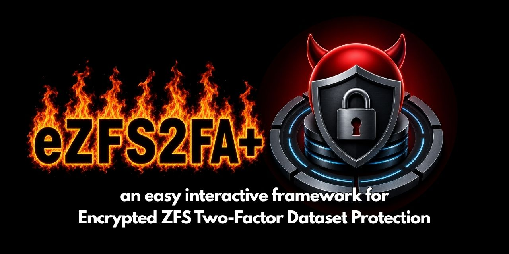

# eZFS2FA+

**`eZFS2FA+`** is a hardened **encrypted ZFS** dataset interactive workflow offering **two-factor authentication** for sensitive services on *FreeBSD* systems, with *Linux* compatibility built in.



<div align="center">

[](LICENSE)&nbsp;
[](#)&nbsp;
[](#)&nbsp;
[](https://www.freebsd.org/)&nbsp;
[](https://kernel.org/)

</div>

💡 The idea is simple: protected services do not start at boot. Their secrets live inside an OpenZFS encrypted dataset that remains locked until the operator explicitly unlocks it.

🔐 The key is wrapped using a FIDO Alliance compatible hardware token (like the keys manufactured by Yubico), a passphrase, or both (recommended).

🥇 FreeBSD is the first-class target. On FreeBSD, transient raw key material is handled through 𝚖𝚍𝚖𝚏𝚜 -𝙼, using 𝚖𝚊𝚕𝚕𝚘𝚌-backed 𝚖𝚍(𝟺) storage.

🐧 On Linux, the same workflow uses 𝚛𝚊𝚖𝚏𝚜.

🚫 In both cases, the raw ZFS key is kept out of normal filesystems or swappable memory. Wiped immediately after use, it never touches hard storage.

ℹ️ This tool supports multiple enrolled keys, a single JSON state file for wrapped-key backup, service-start checks, delayed forced locking, and optional lock-time snapshots.

👌🏻 This design protects data at rest and against offline theft scenarios.
It is built for the real risk of a portable system being lost, stolen, or imaged while powered off.

⚠️ It does not protect against a live fully-compromised root/kernel at unlock time.

---

## ⛓️‍💥 No framework lock-in ⛓️‍💥

With `eZFS2FA+`, there is **no framework lock-in**:
for example, you can securely `zfs send` your raw encrypted dataset to any target.
Just export the ZFS raw encryption key to decrypt it in that new location, even if it doesn't use the `eZFS2FA+` framework.

---

## 📦 Limited dependencies 📦

The dependencies are minimal: python3 plus cryptography library, and libfido2 (FreeBSD) or fido2-tools (Linux).

### 👹 FreeBSD 👹

- python311
- py311-cryptography
- libfido2

### 🐧 Linux 🐧

- python3
- python3-cryptography
- fido2-tools
- zfsutils-linux (assumed installed already for ZFS users)
- util-linux

---

## 🛠️ Installation 🛠️

While the package can be used standalone without installation, it can be installed, including a manpage generated from the included markdown documentation.

On the target system, run the following:
```sh
git clone https://github.com/BillieBadin/eZFS2FA
cd eZFS2FA

doas sh ./install.sh   # FreeBSD
or
sudo sh ./install.sh   # FreeBSD / Linux

ezfs2fa --help
```

---

## ⚠️ Backups ⚠️

**ALWAYS** make backups of the JSON file with the wrappers.
It contains vital information and useless without at least a full wrapper per encrypted dataset: passphrase and/or hardware key; without them or an raw ZFS key, the data is unrecoverable.

An export of the ZFS raw key is also strongly recommended. It provides a native recovery path, fully independant from the wrapping technology used in `eZFS2FA+`.
That key material oviously needs to be handled with utmost care, and be stored in a very safe offline location.

## Licence

This project is licensed under the MIT Licence. See [LICENSE](LICENSE).

Copyright (c) 2026 Billie Badin, SIGORYX Engineering
